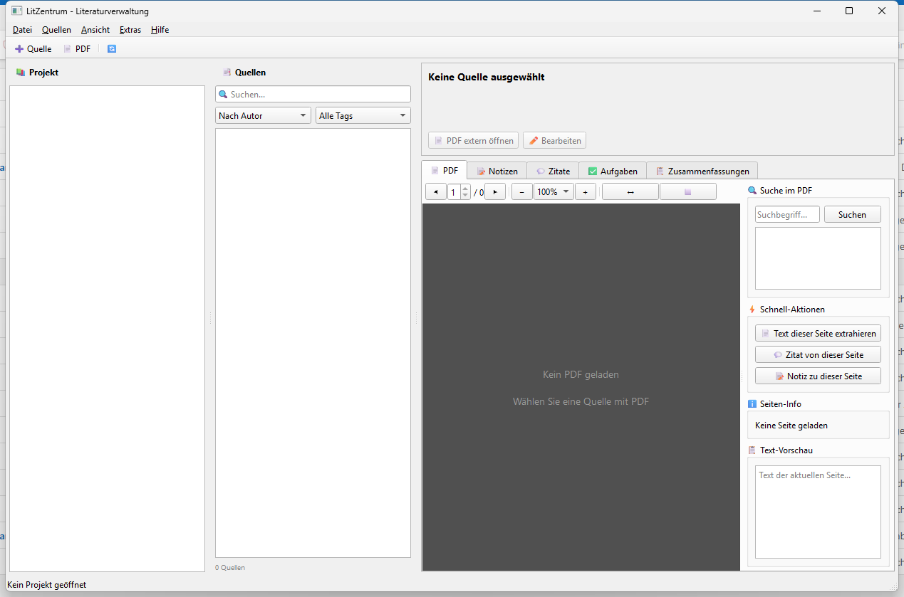

# LitZentrum

**Ordnerbasierte Literaturverwaltung**

Eine Desktop-Anwendung zur Verwaltung akademischer Literatur mit lokalem Speicherformat, PDF-Integration und optionaler KI-Unterstuetzung.

## Features

- 📚 **Ordnerbasiertes System**: Jede Quelle in ihrem eigenen Ordner
- 📄 **PDF-Integration**: Volltextsuche, Textextraktion
- 📝 **Notizen & Zitate**: Seitenverweise, Tags, Kategorien
- ✅ **Aufgabenverwaltung**: Pro Quelle und projektweit
- 📋 **Zusammenfassungen**: Manuell oder KI-generiert
- 📚 **Bibliographie**: BibTeX-Export, mehrere Zitierstile
- 🤖 **KI-Integration**: Lokale Verarbeitung mit Ollama (optional)
- 🔄 **Git-Integration**: Projektversionierung

## Screenshots



## Installation

```bash
# Repository klonen
cd LitZentrum

# Abhaengigkeiten installieren
pip install -r requirements.txt

# Starten
python src/main.py
```

## Abhaengigkeiten

- Python 3.10+
- PySide6
- PyMuPDF (fitz)
- bibtexparser
- jsonschema
- requests (fuer Ollama)

## Projektstruktur

```
LitZentrum/
├── src/
│   ├── main.py                 # Einstiegspunkt
│   ├── core/                   # Kernlogik
│   │   ├── project_manager.py  # Projektverwaltung
│   │   ├── source_manager.py   # Quellenverwaltung
│   │   ├── event_bus.py        # Eventsystem
│   │   └── settings_manager.py # Einstellungen
│   ├── formats/                # Dateiformate
│   │   ├── limeta.py          # Metadaten
│   │   ├── linote.py          # Notizen
│   │   ├── liquote.py         # Zitate
│   │   ├── litask.py          # Aufgaben
│   │   └── lisum.py           # Zusammenfassungen
│   ├── gui/                    # Benutzeroberflaeche
│   │   ├── main_window.py
│   │   ├── panels/
│   │   ├── tabs/
│   │   └── dialogs/
│   └── modules/                # Erweiterungen
│       ├── bibliography/       # BibTeX & Stile
│       ├── pdf_workshop/       # PDF-Verarbeitung
│       ├── ai/                 # Ollama-Integration
│       └── sync/               # Git & Backup
├── schemas/                    # JSON-Schemas
├── tests/                      # Unit-Tests
└── resources/                  # Icons etc.
```

## Dateiformate

Alle Daten werden als JSON gespeichert:

| Format | Beschreibung |
|--------|-------------|
| `.liproj` | Projektkonfiguration |
| `.limeta` | Quellenmetadaten |
| `.linote` | Notizen |
| `.liquote` | Zitate |
| `.litask` | Aufgaben |
| `.lisum` | Zusammenfassungen |

## Projektlayout

```
MeinProjekt/
├── projekt_config.liproj
├── projekt_tasks.litask
├── projekt_notes.linote
├── Quellen/
│   ├── Smith2023_Understanding_AI/
│   │   ├── meta.limeta
│   │   ├── notes.linote
│   │   ├── quotes.liquote
│   │   ├── tasks.litask
│   │   ├── summaries.lisum
│   │   └── source.pdf
│   └── Doe2024_Machine_Learning/
│       └── ...
```

## Zitierstile

- APA (7. Ausgabe)
- MLA (9. Ausgabe)
- Chicago
- DIN 1505-2
- Harvard

## KI-Integration (Optional)

Fuer lokale KI-Features wird Ollama verwendet:

```bash
# Ollama installieren (https://ollama.ai)
ollama run mistral
```

Features:
- Automatische Zusammenfassungen
- Zitatextraktion
- Metadatenerkennung

## Lizenz

AGPL v3 - Siehe [LICENSE](LICENSE)

Dieses Projekt verwendet PySide6 (LGPL) und PyMuPDF (AGPL).

## Version

1.0.0 (Januar 2026)

---

## English

**Folder-Based Literature Management**

A desktop application for managing academic literature with a local storage format, PDF integration, and optional AI support.

### Features

- 📚 **Folder-Based System**: Each source in its own folder
- 📄 **PDF Integration**: Full-text search, text extraction
- 📝 **Notes & Quotes**: Page references, tags, categories
- ✅ **Task Management**: Per-source and project-wide tasks
- 📋 **Summaries**: Manual or AI-generated
- 📚 **Bibliography**: BibTeX export, multiple citation styles
- 🤖 **AI Integration**: Local processing with Ollama (optional)
- 🔄 **Git Integration**: Project versioning

### Screenshots


### Installation

```bash
# Clone the repository
cd LitZentrum

# Install dependencies
pip install -r requirements.txt

# Start
python src/main.py
```

### Dependencies

- Python 3.10+
- PySide6
- PyMuPDF (fitz)
- bibtexparser
- jsonschema
- requests (for Ollama)

### Project Structure

```
LitZentrum/
├── src/
│   ├── main.py                 # Entry point
│   ├── core/                   # Core logic
│   │   ├── project_manager.py  # Project management
│   │   ├── source_manager.py   # Source management
│   │   ├── event_bus.py        # Event system
│   │   └── settings_manager.py # Settings
│   ├── formats/                # File formats
│   │   ├── limeta.py          # Metadata
│   │   ├── linote.py          # Notes
│   │   ├── liquote.py         # Quotes
│   │   ├── litask.py          # Tasks
│   │   └── lisum.py           # Summaries
│   ├── gui/                    # User interface
│   │   ├── main_window.py
│   │   ├── panels/
│   │   ├── tabs/
│   │   └── dialogs/
│   └── modules/                # Extensions
│       ├── bibliography/       # BibTeX & styles
│       ├── pdf_workshop/       # PDF processing
│       ├── ai/                 # Ollama integration
│       └── sync/               # Git & backup
├── schemas/                    # JSON schemas
├── tests/                      # Unit tests
└── resources/                  # Icons etc.
```

### File Formats

All data is stored as JSON:

| Format | Description |
|--------|-------------|
| `.liproj` | Project configuration |
| `.limeta` | Source metadata |
| `.linote` | Notes |
| `.liquote` | Quotes |
| `.litask` | Tasks |
| `.lisum` | Summaries |

### Project Layout

```
MyProject/
├── projekt_config.liproj
├── projekt_tasks.litask
├── projekt_notes.linote
├── Quellen/
│   ├── Smith2023_Understanding_AI/
│   │   ├── meta.limeta
│   │   ├── notes.linote
│   │   ├── quotes.liquote
│   │   ├── tasks.litask
│   │   ├── summaries.lisum
│   │   └── source.pdf
│   └── Doe2024_Machine_Learning/
│       └── ...
```

### Citation Styles

- APA (7th Edition)
- MLA (9th Edition)
- Chicago
- DIN 1505-2
- Harvard

### AI Integration (Optional)

For local AI features, Ollama is used:

```bash
# Install Ollama (https://ollama.ai)
ollama run mistral
```

Features:
- Automatic summaries
- Quote extraction
- Metadata detection

### License

AGPL v3 - See [LICENSE](LICENSE)

This project uses PySide6 (LGPL) and PyMuPDF (AGPL).

### Version

1.0.0 (January 2026)
